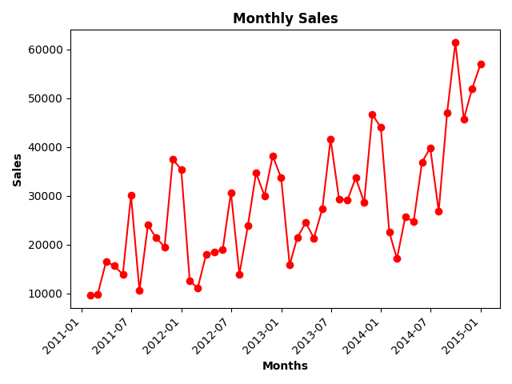
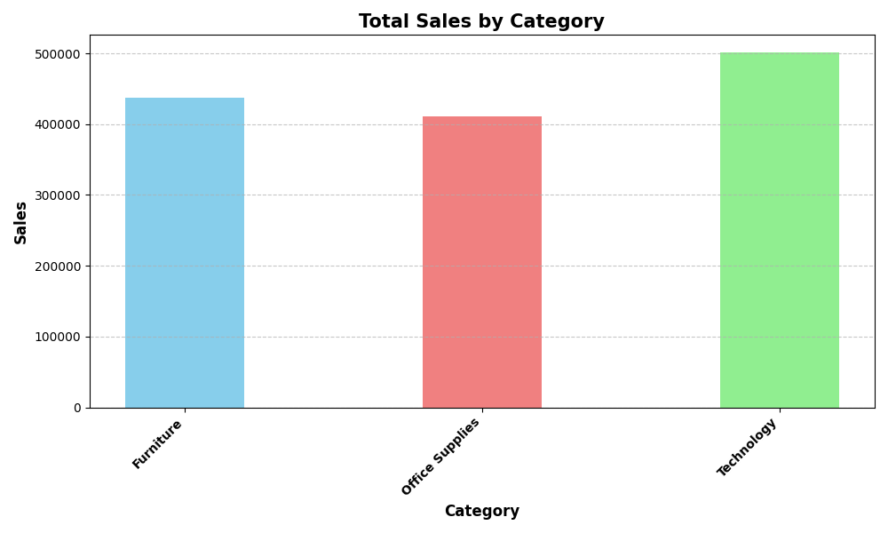
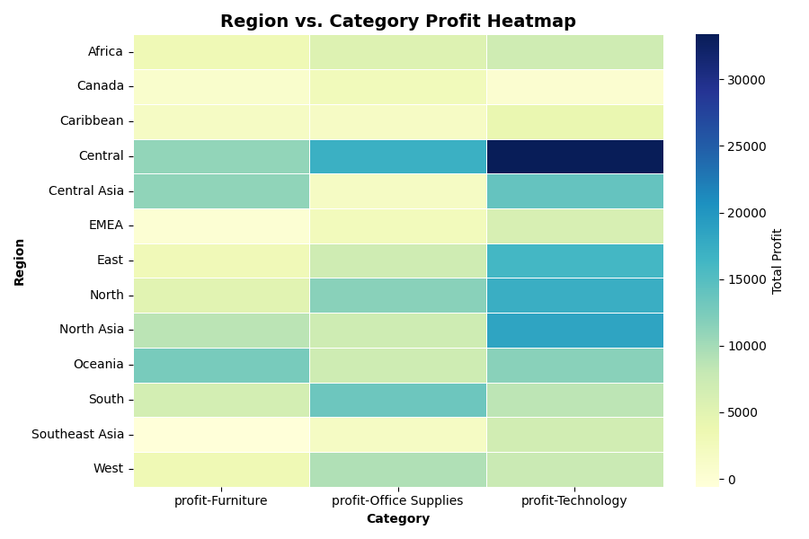

# E-commerce Sales Analysis  

**Goal:** Analyze an e-commerce company’s sales dataset to uncover insights on sales trends, customer behavior, and product performance.  

##  Key Features
1. Data Cleaning (missing values, duplicates, type conversions)  
2. Exploratory Data Analysis (top products, regions, categories)  
3. Time-Series Analysis (monthly sales trends, seasonality)  
4. Customer Analysis (repeat buyers, top customers, loyalty metrics)

##  Tech Stack
- Python  
- NumPy  
- Pandas  
- Matplotlib / Seaborn  

##  Project Structure
- `data/` → raw + cleaned datasets  
- `notebooks/` → step-by-step analysis  
- `reports/` → visuals  

## Key Insights
- The single best-performing month was **September 2014**, while the lowest was **January 2011**.  
- **Furniture** generated the highest sales in this dataset.  
- **West region** underperformed compared to East & Central.  
- Number of unique customers: **795**.  
- Sales were strongest in the **Central & South regions**.  

##  Visualizations
  
  
  

